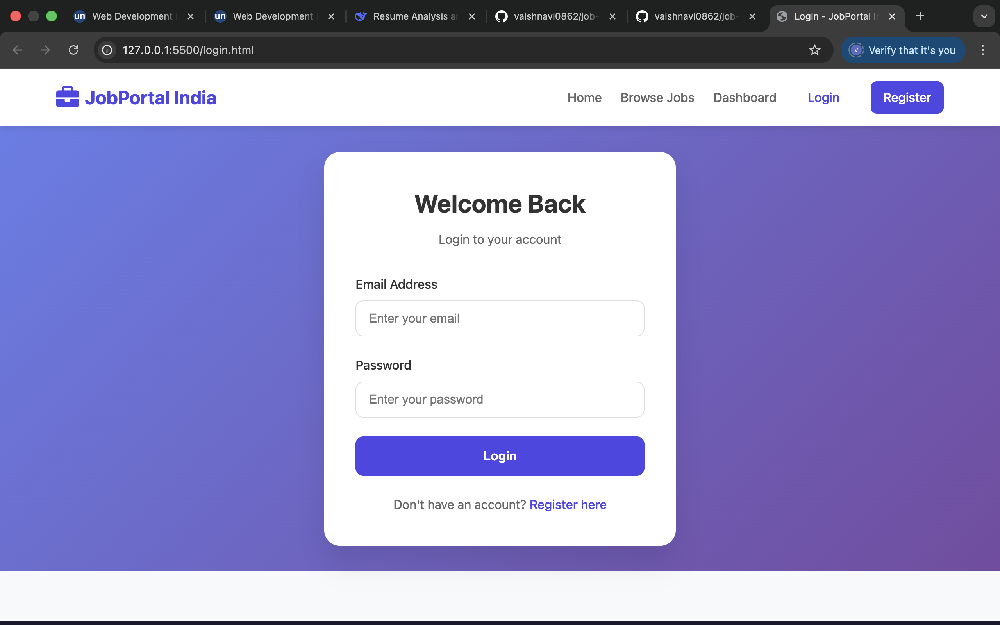
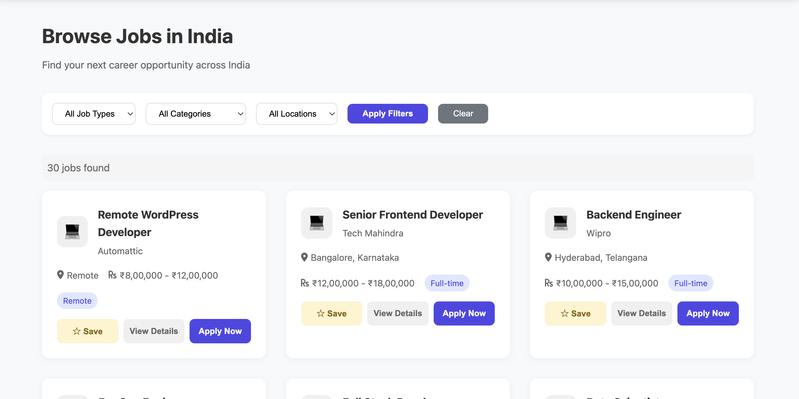
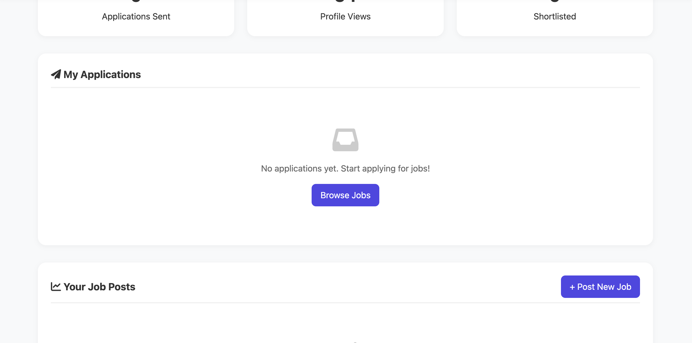
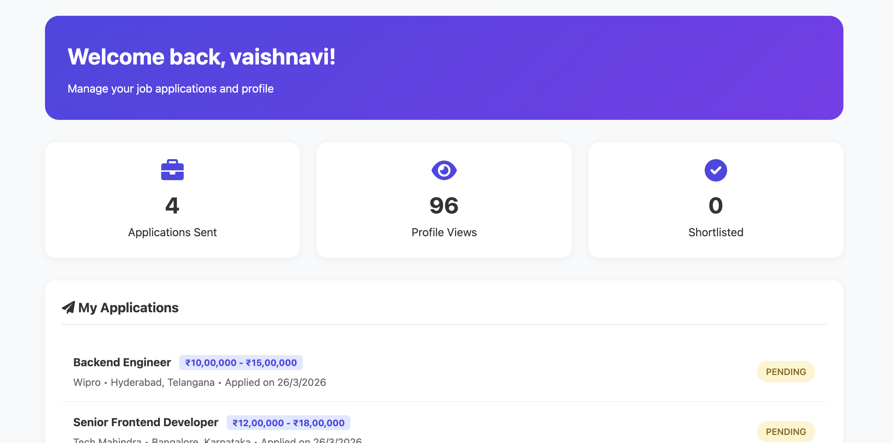
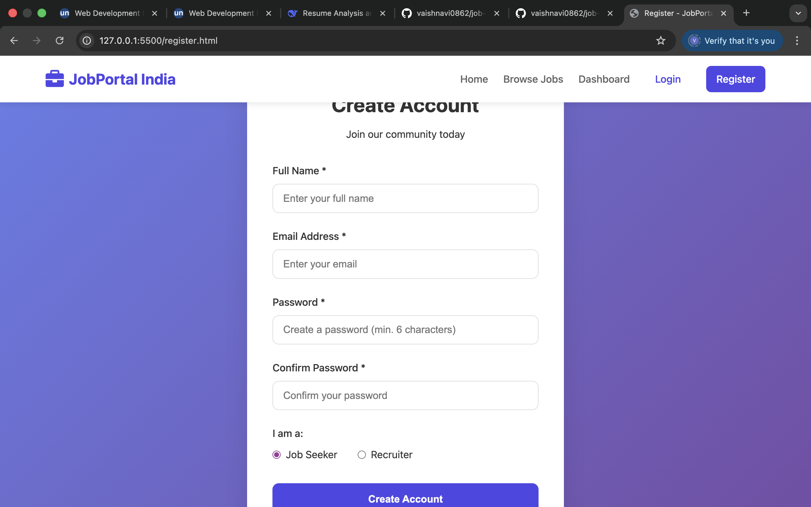

# JobPortal India

A full-stack job portal with JWT authentication, role-based dashboards, job posting, applications, and saved jobs.

## 🚀 Features

- **User Authentication** - Register/Login with JWT tokens
- **Role-Based Access** - Separate dashboards for Job Seekers and Recruiters
- **Job Management** - Post, browse, and search jobs
- **Save Jobs** - Bookmark jobs for later
- **Apply for Jobs** - Submit applications with one click
- **Track Applications** - View application status

## 🛠️ Tech Stack

- **Backend:** Node.js, Express.js, MySQL, JWT, bcryptjs
- **Frontend:** HTML5, CSS3, JavaScript, Font Awesome
## 📸 Screenshots

| Home Page | Login Page |
|-----------|------------|
|  |  |

| Browse Jobs | Profile Page |
|-------------|--------------|
|  |  |

| Applied Jobs | Register Page |
|--------------|---------------|
|  |  |

## 🚀 Getting Started

1. Clone the repository:
   ```bash
   git clone https://github.com/vaishnavi0862/job-portal.git
   cd job-portal
   ```

2. Install dependencies:
   ```bash
   cd backend
   npm install
   ```

3. Set up environment variables:
   ```bash
   cp .env.example .env
   # Edit .env with your database credentials
   ```

4. Create database:
   ```sql
   CREATE DATABASE job_portal;
   ```

5. Start the server:
   ```bash
   node server.js
   ```

6. Open your browser and navigate to:
   `http://localhost:3000`

## 👩‍💻 Author

**Vaishnavi**
- GitHub: [@vaishnavi0862](https://github.com/vaishnavi0862)
